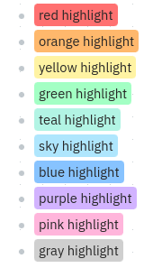
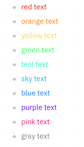
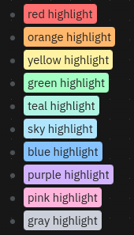
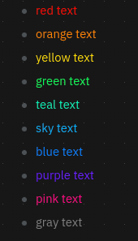
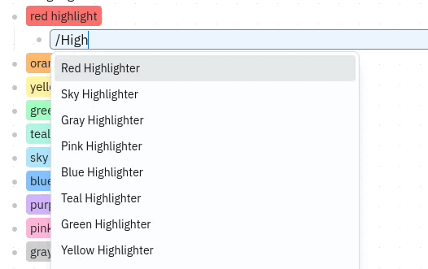
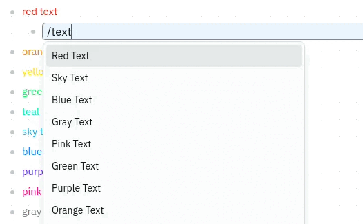

<h1 align="center">
  Logseq Color Markup Plugin
  <span align="right" height="30">&nbsp;</span>
  <a href="https://www.buymeacoffee.com/clemtibs" target="_blank">
    </a>
  </a>
</h1>

<p align="center">
  
</p>

<p align="center">
  <a href="#summary">Summary</a> |
  <a href="#background">Background</a> |
  <a href="#configuration">Configuration</a> |
  <a href="#screenshots">Screenshots</a> |
  <a href="#installation">Installation</a> |
  <a href="#credits">Credits</a>
</p>

<div align="center">


[](https://github.com/brianclements/logseq-color-markup/releases/)
[](https://github.com/brianclements/logseq-color-markup/releases)

</div>
<div align="center">

[](#license)


</div>

<h2 id='summary' style='display: grid;grid-template-columns: 12fr 1fr;'>
  Summary
  <span style='text-align: right'><font size='2'><a href="#">^Top</a></font></span>
</h2>

Add more color options to your highlights and text in Logseq using slash commands.

<h2 id='background' style='display: grid;grid-template-columns: 12fr 1fr;'>
  Background
  <span style='text-align: right'><font size='2'><a href="#">^Top</a></font></span>
</h2>

This plugin was created to fill the gap left when converting my Workflowy maps
to Logseq using [WF2LS](https://github.com/brianclements/wf2ls), but is
completely functional on it's own. Workflowy supports 10 colors for both
highlights and text color, and this plugin enables that functionality with slash
commands.

<h2 id='configuration' style='display: grid;grid-template-columns: 12fr 1fr;'>
  Configuration
  <span style='text-align: right'><font size='2'><a href="#">^Top</a></font></span>
</h2>

You can edit the color and options of the higlights, by adding and editing
this variables in your own theme or your _custom.css_ inside the dark and light
theme.
```css
/* BACKGROUND COLORS*/
--mark-red: #xxxxxx;
--mark-orange: #xxxxxx;
--mark-yellow: #xxxxxx;
--mark-green: #xxxxxx;
--mark-teal: #xxxxxx;
--mark-sky: #xxxxxx;
--mark-blue: #xxxxxx;
--mark-purple: #xxxxxx;
--mark-pink: #xxxxxx;
--mark-gray: #xxxxxx;

/* TEXT COLORS */
--span-red: #xxxxxx;
--span-orange: #xxxxxx;
--span-yellow: #xxxxxx;
--span-green: #xxxxxx;
--span-teal: #xxxxxx;
--span-sky: #xxxxxx;
--span-blue: #xxxxxx;
--span-purple: #xxxxxx;
--span-pink: #xxxxxx;
--span-gray: #xxxxxx;

/*Decoration color*/
--mark-decoration-red: ;
--mark-decoration-orange: ;
--mark-decoration-yellow: ;
--mark-decoration-green: ;
--mark-decoration-teal: ;
--mark-decoration-sky: ;
--mark-decoration-blue: ;
--mark-decoration-purple: ;
--mark-decoration-pink: ;
--mark-decoration-gray: ;

/* OPTIONS */
--mark-text-color: ;
--mark-decoration: ;
--mark-thickness: ;
--mark-border-radius: 4px;
```
<h2 id='screenshots' style='display: grid;grid-template-columns: 12fr 1fr;'>
  Screenshots
  <span style='text-align: right'><font size='2'><a href="#">^Top</a></font></span>
</h2>

Light mode:

<div align="center">




</div>

Dark mode:

<div align="center">




</div>

Slash commands:

<div align="center">




</div>

<h2 id='installation' style='display: grid;grid-template-columns: 12fr 1fr;'>
  Installation
  <span style='text-align: right'><font size='2'><a href="#">^Top</a></font></span>
</h2>

- Clone the repo
- Open the _plugin_ option in Logseq Desktop Client
- Select **Load unpacked plugin** in Logseq Desktop client
- Open the _src_ folder of the repo (where "package.json" is)

<h2 id='credits' style='display: grid;grid-template-columns: 12fr 1fr;'>
  Credits
  <span style='text-align: right'><font size='2'><a href="#">^Top</a></font></span>
</h2>

- Original Code:
  - Forked from [Highlighters for Logseq](https://github.com/DenaroCF/Highlighters-for-Logseq) by DenaroCF
      Copied mostly verbatim with minimal updates into the modern plugin template
- Design and UI Inspiration:
  - [Full House Templates](https://github.com/stdword/logseq13-full-house-plugin) by stdword

<h2 id='license' style='display: grid;grid-template-columns: 12fr 1fr;'>
  License
  <span style='text-align: right'><font size='2'><a href="#">^Top</a></font></span>
</h2>

[MIT License](https://github.com/brianclements/logseq-color-markup/blob/main/LICENSE)
